(:hourglass: *If some animations are not loaded, try to refresh the page.* :repeat:)

# :world_map: MY ROUTE PLANNING RECIPE :cartwheeling:

On this page, I would like to **share my approach** to **designing routes** for **outdoor activities** like `hike`, `run` or `cycling`.

:warning: The methodology presented here may not be flawless:
- Written in **2023**: the showcased features may well become outdated or improved over time.
- Subject to criticism: refer to the **[potential criticisms](#exclamation-criticisms) section**.
- Not exhaustive: be sure to check the **[missing tools](#boom-missing-tools) section** - *perhaps you are already aware of existing alternatives or have the ideas and time to create them.*

---

## :scroll: The recipe in short :cook:

```
1) get inspiration
2) connect the dots
3) check and adjust
```

---

### Content

> My favourite sections are marked with :star:.

- **[Essential tools](#hammer_and_wrench-essential-tools)**
  - [komoot](#green_circle-komoot)
  - [strava heatmap](#orange_circle-strava-global-heatmap-hotsprings)
- **[[1] Get inspired](#1-star_struck-get-inspired)**
  - **[[1.1] From points](#11-pushpin-points)**
    - [komoot highlights](#green_circle-komoot-highlights)
    - [google travel](#airplane-google-travel) :star:
    - [tourist information](#information_source-tourist-information-website)
    - [books and blogs](#books-books-and-blogs)
    - [around.us](#globe_with_meridians-aroundus)
    - [guided tours](#school_satchel-guided-tours) :star:
    - [geocaching](#detective-geocaching)
    - [google My Maps](#world_map-my-maps)
  - **[[1.2] From routes](#12-routes)**
    - [komoot](#green_circle-komoot-1)
      - [suggestions](#green_circle1---1-tour-suggestions)
      - [collections](#green_circle2---books-collections)
      - [suggestions around a highlight](#green_circle3---pushpin-suggestions-around-a-highlight)
    - [outdoor-active](#mountain-outdoor-active)
    - [strava](#orange_circle-strava)
      - [strava global heatmap](#orange_circle1---hotsprings-strava-global-heatmap) :star: :star:
      - [premium suggestions](#orange_circle2---nail_care-strava-premium-suggestions)
      - [activities via segments](#orange_circle3---eyes-strava-activities-via-segments) :star:
    - [rother](#closed_book-rother) :star:
    - [magazines](#newspaper_roll-magazines)
    - [blogs](#desktop_computer-blogs)
    - [events](#confetti_ball-past-events) :star:
- **[[2] Draft](#2-paintbrush-draft)**
- **[[3] Check and adjust](#3-monocle_face-check-and-adjust)**
  - [komoot warnings](#orange_circle-warning-komoot-routing-tips)
  - [elevation profile](#chart_with_upwards_trend-climbs)
  - [surface](#desert-surface)
  - [trail level](#bar_chart-trail-level--difficulty) :star:
  - [usage frequency](#orange_heart-usage-frequency) :star:
  - [traffic](#blue_car-traffic)
  - [smoothness](#sewing_needle-smoothness)
  - [authorization and danger](#white_check_mark-authorisation--danger)
    - [safety](#rescue_worker_helmet-safety)
    - [feasibility](#x-heavy_check_mark-feasibility)
    - [legal](#no_bicycles-legal)
  - [temporary blockage](#no_entry-temporary-blockage)
  - [other maps](#world_map-other-maps) :star:
- **[Conclusion](#dizzy-conclusion)**
  - [final steps](#footprints-final-steps)
  - [still missing](#boom-still-missing) :star:
  - [criticisms](#exclamation-criticisms)
  - [final word](#wave-final-word)

---

### :hammer_and_wrench: Essential tools

Below, **two key tools**, that will be utilized throughout the subsequent sections, are introduced:
- **`komoot`**
- **`strava global heatmap`**

The majority of the showcased features are accessible with a basic **free account**. :smiley:

Disclaimer: It is worth noting that while I find some of their tools fascinating, I do not have any vested interest in promoting `komoot` and `strava`.

#### :green_circle: Komoot

<details>
  <summary>Click to expand</summary>

[`komoot`](https://www.komoot.com) is a comprehensive **route planning** and **navigation** app, available on both `web` and `mobile` platforms.

> In [their own words](https://www.komoot.com/about): "our technology allows everybody to better **find**, **plan** and **live** authentic outdoor experiences."

|                                                                                                      | 
|:-----------------------------------------------------------------------------------------------------------------------------------------------:| 
| *`komoot` provides a **wide range of features**. Here is a brief example of how to **easily draw** a (albeit long :sweat_smile:) hiking route.* |

</details>

#### :orange_circle: Strava global heatmap :hotsprings:

<details>
  <summary>Click to expand</summary>

The [`strava global heatmap`](https://www.strava.com/heatmap) is a **visual representation** that displays the **routes where individuals** are `running`, `hiking`, and `cycling` worldwide.

It can be accessed in high-resolution with a **free `strava` account** _(let's hope it stays that way!)_.

|                                                                               | 
|:----------------------------------------------------------------------------------------------------------------------------------------------:| 
| *`strava global heatmap`: modifying the display settings to `red`, `label`, `standard`, and applying `only by foot` / `only by bike` filters.* |

|                                        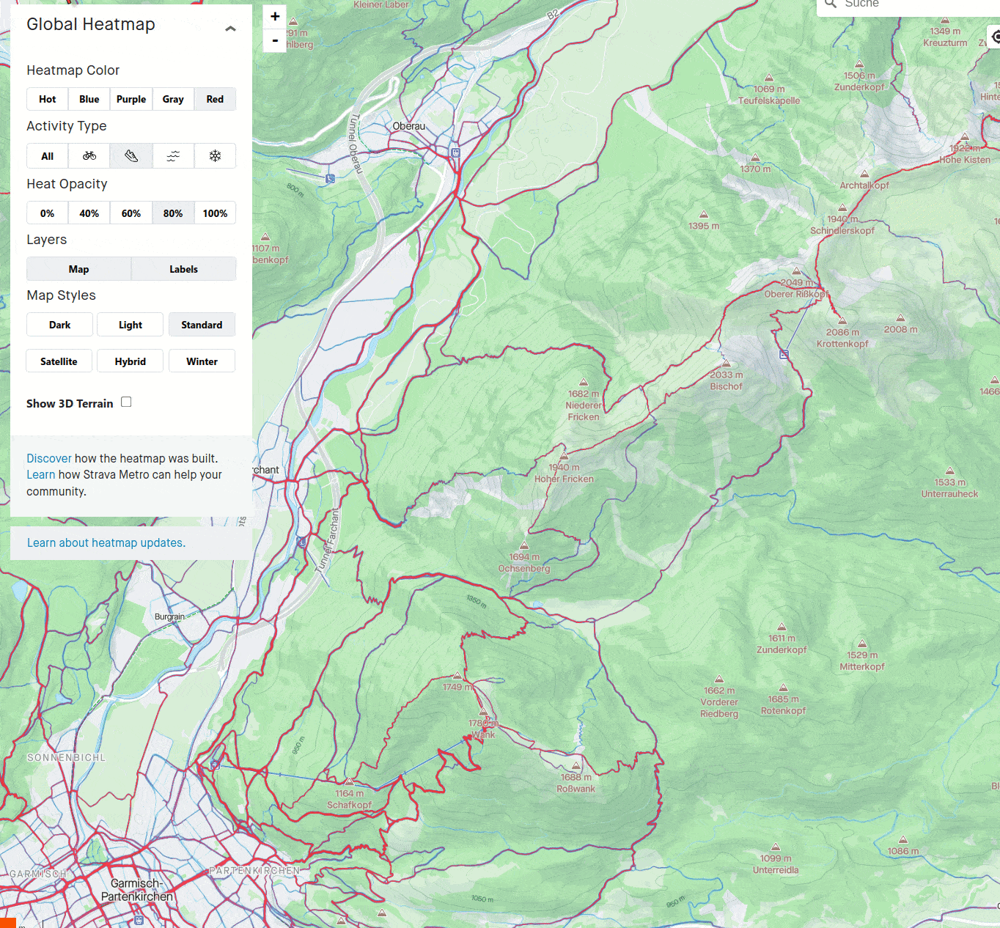                                         | 
|:----------------------------------------------------------------------------------------------------------------------------------:| 
| *The **`winter` map style** :mountain_snow: often provides a **clear depiction of elevation**, even for summer activities :wink:.* |

To learn more, refer to:
- [This article](https://support.strava.com/hc/en-us/articles/216918877-Strava-Metro-and-the-Global-Heatmap)
- [The technical story behind it](https://medium.com/strava-engineering/the-global-heatmap-now-6x-hotter-23fc01d301de)

</details>

---

---

# 1 :star_struck: Get inspired

:camera_flash: The goal of this section is to **discover interesting places** in a given **destination region**.

:warning: Please note that this section is **NOT** about:
- Drawing a route.
- Checking little details.

:bulb: There are two types of **_"inspiration"_**:
- :round_pushpin: **Points**, e.g. a place such a lake, a viewpoint, a summit ...
- :railway_track: **Routes**, e.g. a tour recommended by a book or completed by someone else.

:warning: The methods introduced below **are very diverse**: some **may not be relevant** for your **specific destination and/or activity.**

---

## 1.1 :pushpin: Points

> Note: if **you already know the region** well, you can jump directly to the [next section about `drawing` routes](#23-paintbrush-draw) :wink:

---

#### :green_circle: Komoot Highlights

<details>
  <summary>Click to expand</summary>

They are the **red dots** you see on the [`komoot` planning map](https://www.komoot.com/plan)

> "Every **Highlight** is a personal recommendation that you know you can trust. They are **created by the community**, for the community".

|                                            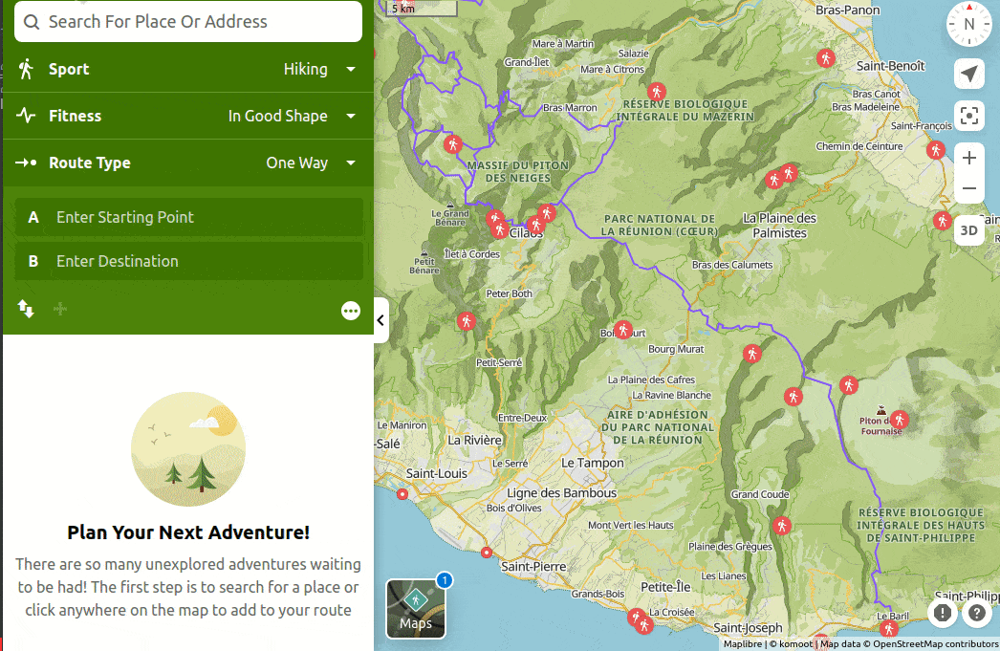                                            | 
|:-------------------------------------------------------------------------------------------------------------------------------------------:| 
| ***`komoot` Highlights** can give a first idea of **what to do** and **what to see**. **Users comments** can provide valuable information.* |

:bulb: Tips:
- **Zoom out** to show only a few dots: these are the **top Highlights**.
- Check the **number of recommendations** and the level of **popularity**.
- Reading **users comments** can be valuable for:
  - **Learning more**, such as the difficulty of a descent, if bicycles are allowed, or information on fares and times for a cable train.
  - Getting the **latest updates**, for example if a trail has been recently affected by a fallen tree.
- Verify the **date of the comments**.
- While `komoot` Highlights are mostly **points** (i.e. places), they can also be **segments** like a nice single-track.
- **`komoot` Highlights** can be found both in [`komoot/places-to-see`](https://www.komoot.com/places/1/places-to-see) and in [`komoot/plan`](https://www.komoot.com/plan) modes.

</details>

---

#### :airplane: Google travel

<details>
  <summary>Click to expand</summary>

`Google Things To Do` is a **search tool** that allows **travelers** to research **attractions, tours and activities**.
- It is planned to be integrated to `google.com` in November 2023.

|                                                                                                                                                                            | 
|:-----------------------------------------------------------------------------------------------------------------------------------------------------------------------------------------------------------------------:| 
| *The **[`things-to-do`](https://www.google.com/travel/things-to-do)** section of `google travel` can give a good **overview** of popular places in a given region. **Bookmarking** favourite places can be convenient.* |

:bulb: Tips:
- Mark places you like with the **`bookmark` symbol** :bookmark:: they will be added to your `google travel plans` list and will be available in the `Saved places` sections of `Google Maps`.
- The bookmarked places can be **visualized** on a smartphone, as demonstrated below.

|                                                                                                        | 
|:---------------------------------------------------------------------------------------------------------------------------------------------------------------:| 
| *The **saved places** can be seen in `Google Maps`, here on a android smartphone, which can give a **convenient summary** of what **you** would like to visit.* |

</details>

---

#### :information_source: Tourist information website

<details>
  <summary>Click to expand</summary>

**Touristic information** resources can help discovering about the region, especially the **events calendar**. :calendar:

|                                 | 
|:----------------------------------------------------------------------------------------:| 
| *Discovering **highlights of a region** as well as the **main events** happening there.* |

:bulb: Tips:
- Check the advantages offered by the **guest card** of the region: :ticket:
  - For instance a **free ride** with the local cable car might inspire you to start your tour from a top station of the cable car. :mountain_cableway:

</details>

---

#### :books: Books and blogs

<details>
  <summary>Click to expand</summary>

**Travel guide books** are huge sources of information and inspiration. They sometimes suggest **itineraries** or `"visiting ... in 1/2/3 days"` plans.

|                                                                                                   | 
|:------------------------------------------------------------------------------------------------------------------------------------------------------:| 
| *[`google books`](https://books.google.com/) can provide **previews** of some (not all) travel guide books. Here looking for inspiration in Provence.* |

:bulb: Tips:
- Check the **year of edition**.
- Buying or lending used travel guide books can be a good option.

Travel and adventure **blogs** can also be very inspiring. :writing_hand:

|                                                                                     | 
|:--------------------------------------------------------------------------------------------------------------:| 
| *Example of a **traveller blog**, full of tips and even a `My Maps` (`My Maps` is covered in a next section).* |

:bulb: Tips:
- Search for `"things to see/do [your destination]"` in `google search`.
- _Want to take **nice pictures** to share with your friends and family?_
  - Then search for `"instagram-able spots [your destination]"`. :selfie:

</details>

---

#### :globe_with_meridians: Around.us

<details>
  <summary>Click to expand</summary>

> "`around.us` is a free, interactive, and easy-to-use **global tourist guide** designed to help you **discover monuments and natural sites** around you."

I discovered this tool in a [French podcast](https://www.gdiy.fr/podcast/jean-francois-pillou/), where the author explains how he used `ChatGPT` to develop `around.us`. :robot:

|                                                                                                                              | 
|:---------------------------------------------------------------------------------------------------------------------------------------------------------------:| 
| *[`around.us`](https://aroundus.com/) offers in one glance **an overview of things to see** in a given region. It comes with pictures and a short description.* |

</details>

---

#### :school_satchel: Guided tours

<details>
  <summary>Click to expand</summary>

This method may be less straightforward. It involves reading the **descriptions of guided tours** to **understand where the guides usually take their guests** to show them the **best places in the region**.
- Keep in mind some possible limitations:
  - Tours derived from such descriptions **may not be feasible on your own**: sometimes a bus-shuttle is arranged by the guiding company.
  - **Descriptions are often sparse** to keep the exact track undisclosed. :wink:
  - Not very quick: retrieving names and locating them on a map **could be tedious**.
- Nevertheless, the **mentioned names** can be enough to **get a good idea of the places to visit**.

|                                                                                              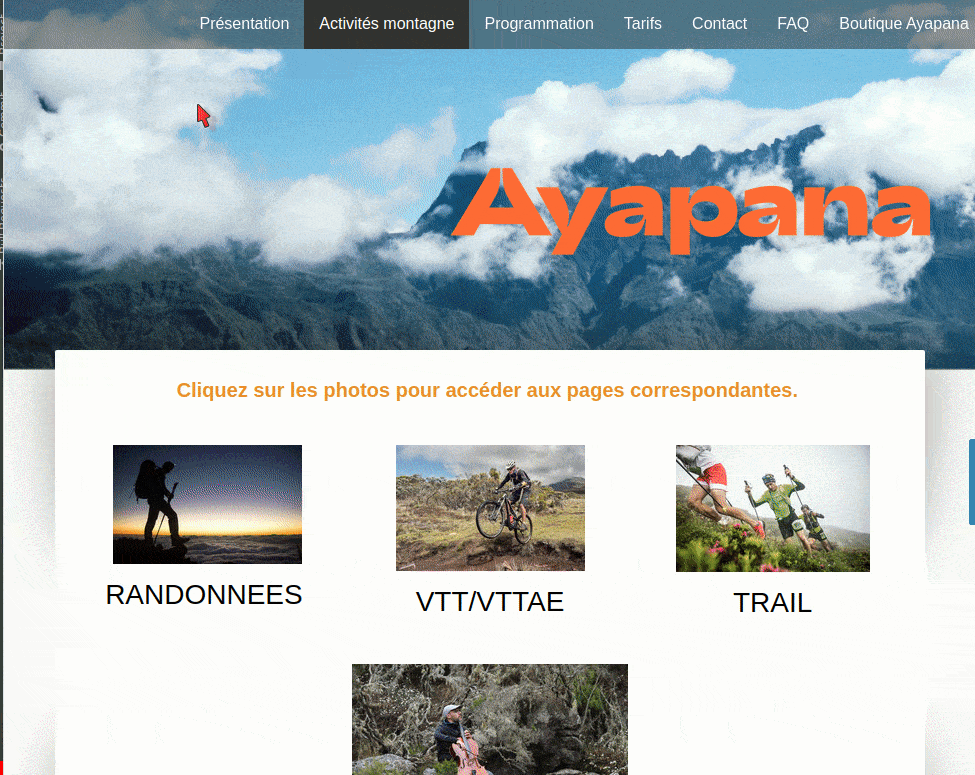                                                                                               | 
|:----------------------------------------------------------------------------------------------------------------------------------------------------------------------------------------------------------------------------:| 
| *This website offers **six guided tours**. In the animation, **names of places** (in French) are successively highlighted. They could give **hints about the best spots** where to ride mountain-bike on La Réunion island.* |

</details>

---

#### :detective: Geocaching

<details>
  <summary>Click to expand</summary>

This game, similar to **treasure hunting**, can provide location ideas for outdoor activities.
- Learn more about this free game at [`geocaching.com`](https://www.geocaching.com/).

|                                                                                                                                 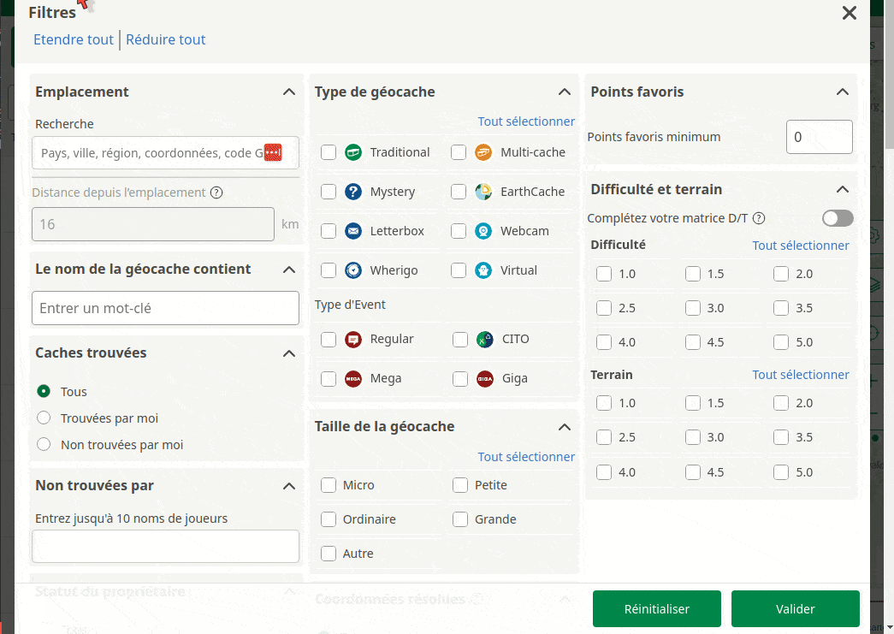                                                                                                                                  | 
|:--------------------------------------------------------------------------------------------------------------------------------------------------------------------------------------------------------------------------------------------------------------------------------------------------------:| 
| *Looking for **geocaches** with high `favourite points` and a reasonable `terrain difficulty`. Then **trying to find on the map a cluster** of them. Here for example **a zone with `6` traditional caches** is discovered. It could be great to **make an activity out of them**, e.g. an hiking tour.* |

:bulb: Tips:
- If there are too many caches available, **filter by favourite points** (`FP`) to focus on the **most popular ones**. 
- Idea for improvement: the favorite points (`FP`) should be **scaled by the number of visits**:
  - For example a cache found `20` times with `20` `FP` should stand out more than one found `10,000` time with only `25` `FP`.
- A geocaching tour can sometimes **be more motivating** for **children** than a simple hike. :cartwheeling:

</details>

---

#### :world_map: My maps

<details>
  <summary>Click to expand</summary>

> How to visualize all the ideas you have collected from diverse sources?

One solution is [`My Maps`](https://www.google.com/maps) from `Google`.

> "`My Maps` makes it easy for you to **create beautiful maps** and **share them** with others."

|                                                                                                                                                                     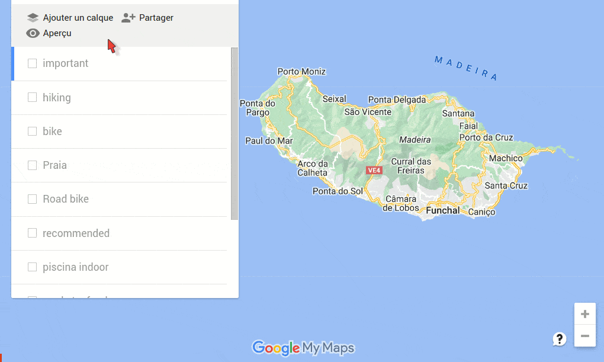                                                                                                                                                                      | 
|:--------------------------------------------------------------------------------------------------------------------------------------------------------------------------------------------------------------------------------------------------------------------------------------------------------------------------------------------------------------------------:| 
| ***`My Maps`** can be convenient to **gather and visualize all the ideas you have been collecting**. Places can be organized in **layers**: e.g. **`important`** (showing the accomodation, the train station, ...), **`view points`**, **`food`** (for the recommended restaurants and bakeries you fancy to try), **`beaches`**, **`markets`**, **`bike rentals`**, ...* |

:bulb: Tips:
- It can be a **good strategy** to choose the **location for your accommodation** based on your `My Maps` that shows an **overview of what you want to do** in a given region.

`My Maps` can also be used to get inspired; **some people share their maps**. :hugs:

|          | 
|:-------------------------------------------------------:| 
| *Finding some `My Maps` online and get inspired by it.* |

:bulb: Tips:
- To **find `My Maps` of other people**, search for `"[your destination] My Maps"` in **`Google Search Image`** and select the images that look like a `My Maps`.
- You can export a `My Maps` found online, and **import it** into yours.
- **`.gpx` files** can also be uploaded to a `My Maps`.

</details>

---

---

## 1.2 Routes

:point_up: We continue here **_[section 1 - get inspired](#1-star_struck-get-inspired)_**, which is about **finding ideas** before creating a route ([section 2](#2-paintbrush-draw)) and verifying it _[section 3](#3-monocle_face-check-and-fine-tune)_.
- Ideas in the **form of "waypoints"** have been collected in the previous subsection (**_[1.1 points](#11-pushpin-points)_**).
- This subsection focuses on **finding inspiration** from **already existing routes**.

:desktop_computer: Nowadays **`.gpx` files of routes** can **easily be found online** but there are a few problems:
- **Tons of routes** are available - it is too much!
- Many are **redundant**.
- Some are **outdated / infeasible / dangerous**.

:question: This raises the question:
- _How to **find nice tours** in a given region that help you **prepare yours**?_

---

#### :green_circle: Komoot

**Three methods** using `komoot` are introduced:

##### :green_circle:1 - :+1: Tour suggestions

<details>
  <summary>Click to expand</summary>

> "The `komoot` **tour suggestions** you receive through the **search function** consist **exclusively of automatically generated Tour recommendations**, known as [`Smart tours`](https://support.komoot.com/hc/de/articles/360058879211)." :genie:

|                                             | 
|:------------------------------------------------------------------------------------------------:| 
| *Based on the activity type and filters, tours are suggested by the **`komoot`-search-engine**.* |

Learn out more in [this article](https://support.komoot.com/hc/en-us/articles/4402815332250-Discover-Find-Tour-suggestions).

</details>

##### :green_circle:2 - :books: Collections

<details>
  <summary>Click to expand</summary>

**`komoot` Collections** are **compilations of multiple tours** in a specific region. For instance:
- Some **private users** share their multiple-day trips.
- Some tourism agencies promote their region by showcasing examples of tours.

`komoot` Collections can be browsed in [this page](https://www.komoot.com/discover-browse).

|                                                                                  | 
|:-------------------------------------------------------------------------------------------------------------------------------------:| 
| *Looking for a **`komoot` Collection** about `"crossing the Alps with the mountain bike"` - example of a collection created by user.* |

|     | 
|:--------------------------------------------------------------------------------:| 
| *Example of a **Collection** created by a tourism agency to promote its region.* |

</details>

##### :green_circle:3 - :pushpin: Suggestions around a highlight

<details>
  <summary>Click to expand</summary>

It is possible to **receive suggestions for tours** that **include a place** you have found (see the [related section](#green_circle-komoot-highlights) as **`komoot` Highlight**.

|                                                        | 
|:---------------------------------------------------------------------------------------------------------------------------------------------:| 
| *Searching for hike **around a `komoot` highlight**: the **suggestion system** is the same as above, i.e. tours are automatically generated.* |

</details>

---

#### :mountain: Outdoor-active

<details>
  <summary>Click to expand</summary>

The **[route finder tool](https://www.outdooractive.com/en/routes/) of `outdoor-active`** is similar to that of `komoot`.
- However, recommended tours are not generated by an engine; instead, they have been created by users.

|                                | 
|:-----------------------------------------------------------------------------:| 
| *Routes can easily be found with the **"Route Finder"** of `outdoor-active`.* |

:bulb: Tips:
- If **too many results** are shown, apply the **`Top routes` filter** to only keep the best ones.
- Routes marked as **"premium"** cannot be fully visualized, however:
  - The **small preview** is often enough to understand the track or re-create it on your own.
  - The **name of the tour** can be searched for in a search-engine to find the `.gpx` on other websites.

</details>

---

#### :orange_circle: Strava

**Three methods** using `strava` are introduced:

##### :orange_circle:1 - :hotsprings: Strava global heatmap

<details>
  <summary>Click to expand</summary>

:point_up: In my opinion, the **very first step** when searching for activities in a region should be to consult the `strava global heatmap`

|                                                                              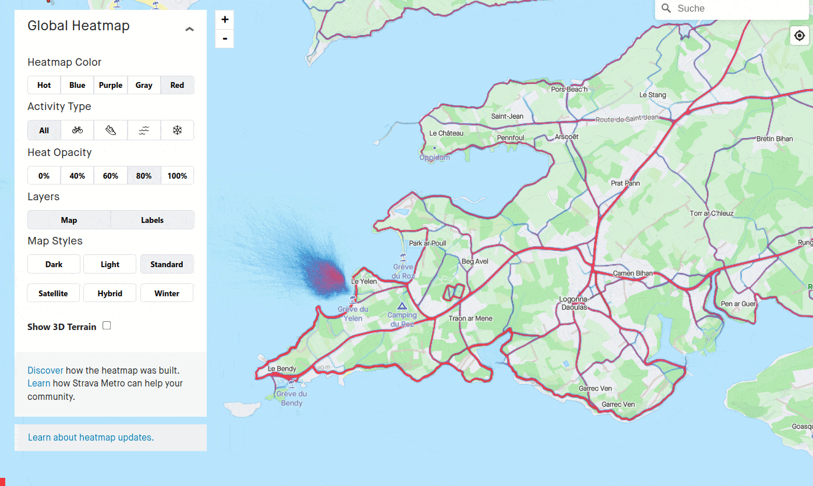                                                                              | 
|:-------------------------------------------------------------------------------------------------------------------------------------------------------------------------------------------------------------------------:| 
| *A **clear overview can quickly be gained**: while this area does not seems to offer many options for `cycling` tours, it seems very popular for `hiking`. **Tours can easily be imagined following the "_hot_" paths**.* |

|                                                                                                      | 
|:---------------------------------------------------------------------------------------------------------------------------------------------------------:| 
| *The `strava global heatmap` can be used to **discover popular trails**. In this example a **pump track for mountain bike** is discovered by zooming in.* |

</details>

##### :orange_circle:2 - :nail_care: Strava-premium suggestions

<details>
  <summary>Click to expand</summary>

Similar to the `komoot` suggestion system, i.e. with automatically generated tour recommendations, but exclusive to **premium account** holders.
- More details [here](https://support.strava.com/hc/en-us/articles/360039136692-Suggested-Routes).

</details>

##### :orange_circle:3 - :eyes: Strava activities via segments

<details>
  <summary>Click to expand</summary>

This is a **more advanced** method.

Currently, there is **no direct "search for others' activities" feature** in `strava`.

:cook: Here is my method to **find activities**, using the `segment explorer`:
- 1- Open the **`strava segment explorer`** (`strava.com` -> `Explore` -> `Segment Explore`).
- 2- Choose one segment near your target destination.
  - :point_up: Ensure that the **"number of attempts"** of this segment is not too small.
- 3- In the page of the segment, the **leaderboard** section (ranking of strava users) gives you access to each **activity that includes this segment**.
  - :point_up: Verify that they are recent.

|                                                                                                                                                                                                                                                                                                                                                             | 
|:----------------------------------------------------------------------------------------------------------------------------------------------------------------------------------------------------------------------------------------------------------------------------------------------------------------------------------------------------------------------------------------------------------------------------------:| 
| *_What about riding close to the Piton de la Fournaise **vulcano** :volcano:?_ Look for **`strava` segments** close to this place. The **one on the cliff** looks be beautiful, doesn't it? With **`250` attempts**, it seems **fairly popular**. In the leaderboard section, open **multiple** (here `5`) **activities** that are **recent** _(`2023` at the time of writing)_ and finally **compare them** to **get inspired**.* |

</details>

---

#### :closed_book: Rother

<details>
  <summary>Click to expand</summary>

[`Rother`](https://www.rother.de/en/) is a German publisher known for producing **popular guides** for outdoor activities, primarily **focused on hiking**. :hiking_boot:
- This resource can be very valuable to **quickly** get **detailed overviews** of great tours in a given region.

:cook: My recipe:
- 1- Search for **"`Rother [YOUR DESTINATION]`"** in a search engine. 
- 2- Open the corresponding `Rother` page.
- 3- Among the preview images, you can **find tour ideas** using:
  - The **"overview map"**.
  - The **"table of contents"**.

|                                                                                                                                                                                                                                                                                                                                                                                                                | 
|:-----------------------------------------------------------------------------------------------------------------------------------------------------------------------------------------------------------------------------------------------------------------------------------------------------------------------------------------------------------------------------------------------------------------------------------------------------------:| 
| *Example of `Rother` edition for **Iceland** :iceland:. The **`Rother` map offers an excellent overview** of where to hike on the island. The **table of contents** provides the **names of each tour**, which can usually easily be **searched for** to get more details: in this example, the tour `#22 - Hengifoss` is google-searched and **successfully found on another website** (`outdoor-active`) which provides a corresponding `.gpx` file too.* |

:bulb: Tips:
- The `Rother` **table of contents** lists the tours and marks some of them as `TOP`, whereas the `Rother` **map** does not show by default which tours are the `TOP` ones.
  - Manually **highlighting** them can enrich the **map** overview.
- `Rother` editions are often updated. Therefore, ensure you are using the **newest version**.
- Details of recommended tours can usually **be found online, very easily, based on their name**.
  - **Cross-check** information from **multiple websites**.

|                                   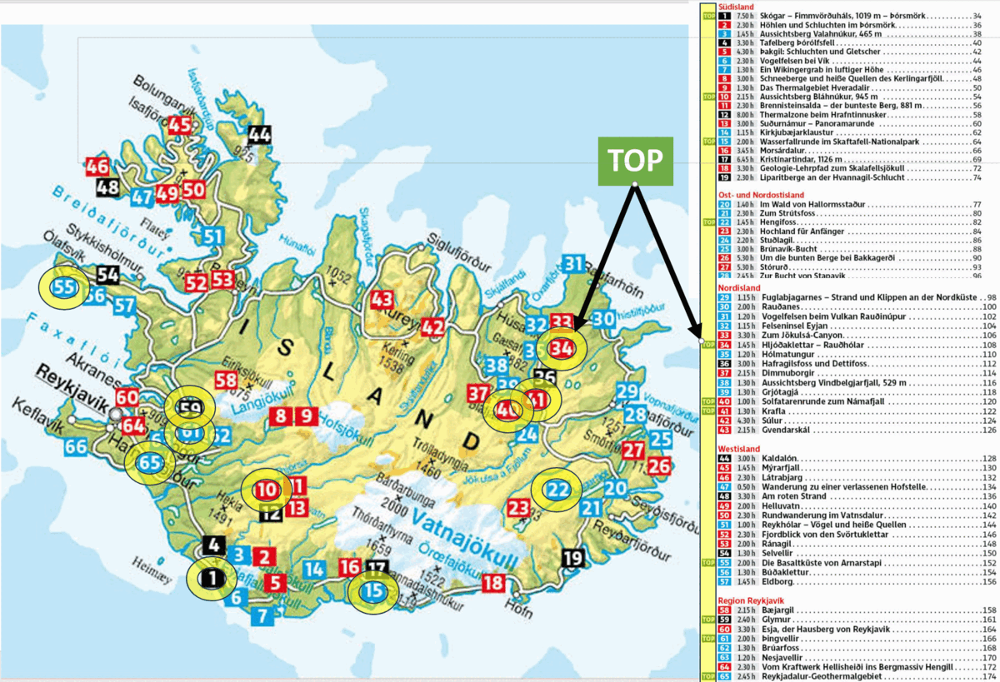                                   | 
|:-------------------------------------------------------------------------------------------------------------------------------:| 
| ***Highlighting** the tours **marked as `TOP`**, based on the `Rother` **table of contents**, can enrich the **map** overview.* |

:bulb: Tips:
- This **map overview** can help choosing a location for an **accomodation place from which multiple top tours** can be easily accessed.
  - In the example above, **two clusters** of `TOP` tours appear at first sight: `34+40+41` and `59+61+65`.
  - Other info such as accessibility (e.g. bus lines or road from an airport) should be considered as well.
- If you like, you can buy the (second-hand) `Rother` book, e-book or app and get direct access to the `.gpx` files.

</details>

---

#### :newspaper_roll: Magazines

<details>
  <summary>Click to expand</summary>

Some **outdoor magazines** publish inspiring **travel reports** about specific regions, typically accompanied by beautiful pictures and **documented tours**.

Such articles often come with a link to the tours, for instance [this one](https://www.mountainbike-magazin.de/vogesen1222/).

|             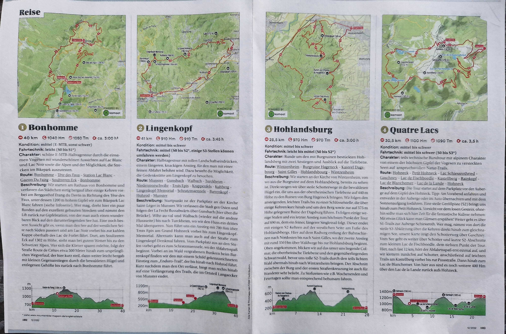             | 
|:-----------------------------------------------------------------------------------:| 
| *Tours included in a reportage about Vosges by `mountainbike-magazin` in 12/2022.* |

|                                                            | 
|:-----------------------------------------------------------------------------------------------------------------------------------:| 
| *The corresponding `komoot` collection, and an overview of the numerous other **collections published** by `mountainbike-magazin`.* |

</details>

---

#### :desktop_computer: Blogs

<details>
  <summary>Click to expand</summary>

Some enthusiastic local hikers enjoy **sharing their best tours** and offering **insider tips**, for instance [Sieben Inseln](https://siebeninseln.de/en/)

|                                                                                            | 
|:-------------------------------------------------------------------------------------------------------------------------:| 
| *:+1: Kudos to Dagmar from [Sieben Inseln](https://siebeninseln.de/en/) who documents for free many hikes in her region.* |

</details>

---

#### :confetti_ball: Past events

<details>
  <summary>Click to expand</summary>

> Are you interested in walking, running, or riding a route of a **past event**, such as a **race**?"

In some cases the `.gpx` of the route can easily be retrieved ...

|                                                            | 
|:-------------------------------------------------------------------------------------------------------------------------:| 
| *Some events let you **check the details of the course**, with a nice map, and sometimes even **offer the `.gpx` file**.* |

... but this is not always the case, consider this example:

| 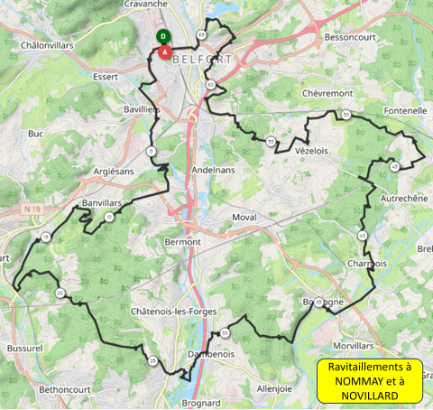 | 
|:-----------------------------------------------------------:| 
|    *How to retrieve an accurate route from this image?*     |

:crayon: One option is to try to manually **draw the route**, e.g. with `komoot`, trying to **match the line** on the image with paths known by `komoot` / `strava heatmap`.
- Issue: apart from being **tedious**, this approach **may not be possible given the low resolution** of the image.

:eyes: Another option is to **look for the strava account of a participant** who recorded **this activity** and made it publicly available?
- _But what if **you do not know anyone** who took part to the event?_
 
:mag: A third option would be to look for strava activities having the name of the event (e.g. `"transterritoire 2023"`).
- But `strava` does not offer such `"find an activity by name"` feature.

:cook: Here is my (a bit advanced) recipe:
- 1- Find a **`strava` segment** on the course (see Tips below).
- 2- Check the **leaderboard** of this `strava` segment, which lists `strava` members' performances on this segment.
- 3- Find one performance **on the date of the event**. :calendar:
- 4- Access to the corresponding `strava` activity. :tada:

:bulb: Tips:
- The [`strava-segment-explorer`](https://support.strava.com/hc/en-us/articles/216918147-How-to-Find-Segments-on-the-Strava-Website) is a nice map that can be find at `strava.com` -> `discover` -> `discover segments`.
- **`strava` segments** can be searched by `name` or `keyword`, e.g. the **name of the event**.
- `strava` segments can also be searched using the excellent [`SegmentExplorer`](https://www.doogal.co.uk/SegmentExplorer) by `doogal.co.uk/`.

|                                                                                                                                                                                                                                                                                                                                                                                                                                                                                                                                                                                                                   | 
|:----------------------------------------------------------------------------------------------------------------------------------------------------------------------------------------------------------------------------------------------------------------------------------------------------------------------------------------------------------------------------------------------------------------------------------------------------------------------------------------------------------------------------------------------------------------------------------------------------------------------------------------------------------------------------------:| 
| *Finding a `strava segment` located on the route, **from a low-resolution image of this course**: roughly align the two maps (here a main road crosses a smaller road), identify a particular shape on the route (here a nice straight line crossing a big road, followed by a climb), then zoom in on the `segment explorer` and align the two maps using their elements (e.g. village names, lakes and roads), and look for **segments that could be on the actual route**. Open the segment page. Go to the **leaderboard**. Check if some performances have the **date of the event**. If so, open the **corresponding activity** by clicking on the date (not the username).* |

Two issues may occur when trying to find **segments on the route**:
- The segment is **not laying on the route**.
  - Solution: try other segments.
- The segment is on the route, but **no performance is listed** in the **top-10 leaderboard**, with the **date of the event**.
  - Solution-0: with `strava premium`, one can see all performances in the leaderboard, not just the top-10.
  - Solution-1: with `strava premium`, filters can be applied, for instance a "date" filter.
  - Solution-2: usually, **the `"women: all-time"` classification** is less busy than the `"men: all-time"`, therefore it is **more likely to contain activities the date of the event**.

:gift: Bonus: **how to export a `.gpx`** from a **`strava` activity?**
- Option-1: use `strava premium`.
- Option-2: there are some good tools around - look in `google-search`: [example1](https://glops.ee/glops-globalspark-ou/glops-ee-apps/), [example2](https://www.cycloworld.cc/article/how-to-download-a-strava-gpx-without-premium/1867).

</details>

---
---

# 2 :paintbrush: Draft

It is time to **connect the waypoints** you have **identified** and/or adjust the **route you have found**.

The goals of this section are to: 
- :writing_hand: Draft a route using your result(s) of the previous section. 
- :white_check_mark: Make sure the **length** and **elevation** of the drafted route are ok for you.
  - If not, **adjust** the drafted route.

<details>
  <summary>Click to expand</summary>

|                                                                                                                                                                                                                                                                                                                               | 
|:----------------------------------------------------------------------------------------------------------------------------------------------------------------------------------------------------------------------------------------------------------------------------------------------------------------------------------------------------------------------------:| 
| ***Drafting a route** with [`komoot/plan`](https://www.komoot.com/plan) is easy: define a `start`, a `destination`, and an `activity type`. That's it. Further **waypoints** could be added to the drafted route. Now you can **check if the `length` and `elevation`** of the route are ok for you. In this example, **`40 km` may be a bit too much** for a one-day hike.* |

For more details on [`komoot/plan`](https://www.komoot.com/plan):
- Check [Route Planner Tips and Tricks](https://www.komoot.com/help/routeplanner) by `komoot`.
- Look for _"How to plan a route using `komoot`?"_ in a search-engine.

:bulb: Tips:
- You may have got a **`.gpx` file** from the previous section: `komoot` let you easily **import** such file as a `komoot/plan`, and **edit it**.

</details>

---

---

# 3 :monocle_face: Check and adjust
The goal of this section is to **optimize the drafted route**, making it **as enjoyable as possible**:

Below is a list of things to check.

I advise you to:
- :eyes: Check and adjust first on a **coarse** level: consider **re-routing** if necessary.
- :microscope: Only then focus on **small details**. :mag:

After completing this section, your route will be ready!

---

#### :orange_circle: :warning: Komoot routing tips

<details>
  <summary>Click to expand</summary>

The first step is to review the **warnings generated by `komoot`**.
  
> "Be it a **rough road**, **private land** or a particularly **steep stretch of trail**, `komoot`’s tips deliver helpful information about your **route’s characteristics**, so you can better **prepare yourself** for your adventure."

|                         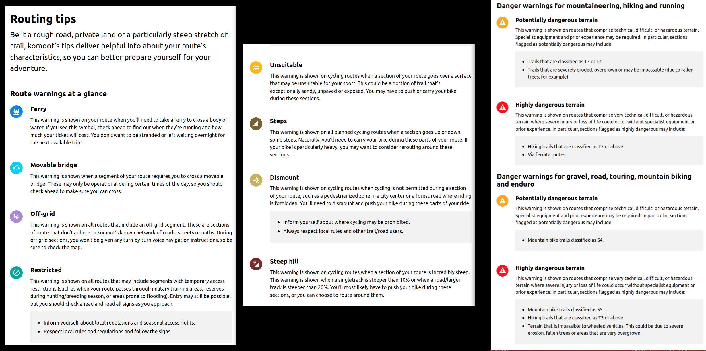                         | 
|:-------------------------------------------------------------------------------------------:| 
| *Learn more about the `Routing tips` in [this page](https://www.komoot.com/help/warnings).* |

</details>

---

#### :chart_with_upwards_trend: Climbs

<details>
  <summary>Click to expand</summary>

Check the **elevation profile** and, if necessary, consider **re-routing parts** of the tour.

|                                                                                                                                                                                         | 
|:----------------------------------------------------------------------------------------------------------------------------------------------------------------------------------------------------------------------:| 
| *Visualize the **elevation profile**, identify **steep climbs**, consider **alternatives** using `strava-global-heatmap`, and confirm that the **new tour characteristics** (`waytypes` and `surfaces`) are suitable.* |

</details>

---

#### :desert: Surface

<details>
  <summary>Click to expand</summary>

Verify the `way type` and `surface type`, and if needed, **re-route specific parts** of the tour.

> **`Way types`** describe the nature of the route (`path`, `cycleway`, `street`, `highway`, `trail`, `singletrack` or `road`) ([source](https://www.komoot.com/tour-characteristics)).

> **`Surface types`** describe the actual condition: whether it’s `sand`, `asphalt`, `cobblestones`, or `gravel` ([source](https://www.komoot.com/tour-characteristics)).

|                                                                                                                                                                                                                                                                                                                                                                                                                                                                                                                                                                                                                              | 
|:-------------------------------------------------------------------------------------------------------------------------------------------------------------------------------------------------------------------------------------------------------------------------------------------------------------------------------------------------------------------------------------------------------------------------------------------------------------------------------------------------------------------------------------------------------------------------------------------------------------------------------------------------------------:| 
| *Checking the **surface** for a **road-cycling** tour: **clicking on the problematic surfaces** (`Unpaved: 272 m`, `Compacted Gravel: 966 m`, `Cobblestones: 1.12 km`) make the **map jump** to the corresponding sections. Then, using images showing the path, **one can decide if it is ok** to ride with a road-bike. **Alternatives can be considered** at the same time: in this example, **the `Compacted Gravel` section is not ideal**, but it is short and calm while the alternative (orange road) would add some steep climbs. The **`cobblestones` section** is also accepted, **based on pictures**, an will let the rider visit the old city.* |

:bulb: Tips:
- :balance_scale: **Consider trade-offs**: **road-cycling tours** prefer **`asphalt` and `paved` surfaces**, but **small roads with less traffic** can also be appealing.
  - On the one hand, `state roads` may offer **ideal surfaces**, but can be busy and potentially dangerous.
  - On the other hand, a **small street** with **`compact gravel` surface** may not be ideal for road-bike tires, but it can offer a **scenic ride**.
- :computer_mouse: To **inspect parts of the route** with a given `surface`, **click on the `surface types`**: the map will jump to the corresponding parts.
  - **Repeat clicking** to move to the next part.
- :chart_with_upwards_trend: Display the `Waytypes and Surfaces` along with the **elevation plot** (bottom of the map) for an **overview of the characteristics** along the route.

</details>

---

#### :bar_chart: Trail level / difficulty

<details>
  <summary>Click to expand</summary>

Evaluate the **technical difficulty** of the trails.
 Komoot sometimes  like the SAC Hiking Scale and MTB Single Track Scale.

`komoot` sometimes provides a **"difficulty level"** for `hiking` and `MTB` paths using different scales:
- [SAC Hiking Scale](https://www.komoot.com/help/hiking-scale).
- [MTB Single Track Scale](https://www.komoot.com/help/mtb-scale).

|                                      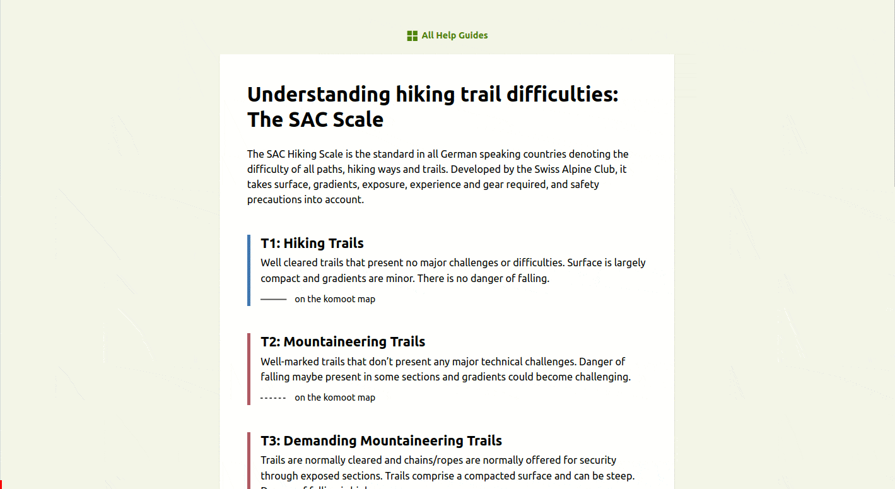                                      | 
|:-----------------------------------------------------------------------------------------------------------------:| 
| *Checking the **technical difficulty of the route** with the `SAC Hiking scale`, `komoot` warnings and pictures.* |

The [`komoot-trail-view`](https://support.komoot.com/hc/en-us/articles/4778848157082-Komoot-Trail-View-Show-pictures-of-the-trail) is a feature to **see pictures of the actual site**, taken by other users.

|                                                                                                                                                                                                                                                                                                                                                                                                                                                                                                                                                          | 
|:-----------------------------------------------------------------------------------------------------------------------------------------------------------------------------------------------------------------------------------------------------------------------------------------------------------------------------------------------------------------------------------------------------------------------------------------------------------------------------------------------------------------------------------------------------------------------------------------------:| 
| *Checking the **technical difficulty** of the a **mountain-bike downhill**: the **[single track scale](https://www.komoot.com/help/mtb-scale)** shows `S2` - but this feature seems restricted to `komoot` premium. [`trailforks`](https://www.trailforks.com/), despite using a different [scale system](https://www.trailforks.com/about/metadata/), can serve the same purpose. Other `komoot` features are helpful: first the **way-type (`singletrack`)**, its **surface (`natural`)** and its **slope (up to `~20%`)**. The **`komoot-trail-view`** is **really valuable** in this case.* |

:bulb: Tips:
- The levels (`S0`, `S1` ... for MTB and `T0`, `T1` ... for run/hike) may only be available with a **`komoot` premium subscription**.
- However, other websites, e.g. [`trailforks`](https://www.trailforks.com/), also provide reference to the **difficulties of popular trails**.

</details>

---

#### :orange_heart: Usage frequency

<details>
  <summary>Click to expand</summary>

 between two options? The Strava Global Heatmap 
> Undecided between two options?
- The `strava-global-heatmap` is a convenient tool to check which one is **more frequently used**, and therefore **potentially more reliable**.

|                                                                                      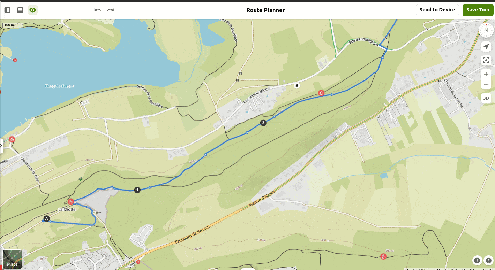                                                                                      | 
|:---------------------------------------------------------------------------------------------------------------------------------------------------------------------------------------------------------:| 
| *On the `komoot` planning map, **multiple variants are possible**. After **aligning the `strava-global-heatmap` with the `komoot-map`**, one can see that **the south-option is not frequented** at all.* |

|                                                                                                                                                                                                                                                                                                                                                                                                                                                                                                                                                                                                                                                                                                                                                       | 
|:--------------------------------------------------------------------------------------------------------------------------------------------------------------------------------------------------------------------------------------------------------------------------------------------------------------------------------------------------------------------------------------------------------------------------------------------------------------------------------------------------------------------------------------------------------------------------------------------------------------------------------------------------------------------------------------------------------------------------------------------------------------------------------------:| 
| *`komoot` suggests to exit the "yellow road", **take a small lane**, and eventually come back to the yellow road. While changing lanes might be tedious (especially in downhill), `komoot` probably considers it beneficial as **"yellow roads" may be full of fast cars**. But looking at it closer, it **may not be the best option**. First, the alternative lane is **narrow and steeper**. Then, the `strava-global-heatmap` shows that **the yellow road is much more frequented**. Finally, the `street view` confirms that the yellow lane is **not that bad to ride**. Adding a waypoint excludes the lane, but another one is added* :sweat_smile: *The `strava-global-heatmap` showed almost no activity on it. Moving the route by **adding an extra waypoint** fixes it.* |

</details>

---

#### :blue_car: Traffic

<details>
  <summary>Click to expand</summary>

It may not be enjoyable to walk or ride on a highly frequented road, especially for road cycling.

While `komoot` already indicates the **type of road (`cycleway`, `street`, `state road` ...)**, it is worth verifying the **actual traffic**.

|                                                                                                                                                                                                                                                                                                                                                                                                                                                                                                               | 
|:----------------------------------------------------------------------------------------------------------------------------------------------------------------------------------------------------------------------------------------------------------------------------------------------------------------------------------------------------------------------------------------------------------------------------------------------------------------------------------------------------------------------------------------------:| 
| *This bridge should be easy to cross, shouldn't it? It is marked as **`cycleway`** by `komoot`. In addition, it seems **fairly frequented** by cyclists based on the `strava-global-heatmap`. But the **limited popularity** (`19/26`), the **comments** and the **`street-view`** give **hints** that it might **not be so easy**. In reality this section is **really impressive to ride**, due to the wind and the **fast vehicles driving very close to the cycling lane**. Unfortunately there is **not easy alternative** in this case.* |

</details>

---

### :sewing_needle: Smoothness

<details>
  <summary>Click to expand</summary>

Remove any **irregularities in the trajectory** that may perturb the navigation.

|                                                                                           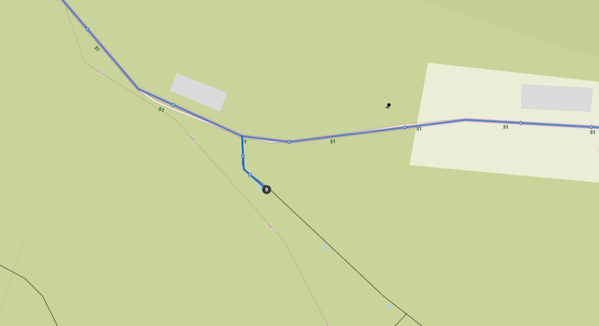                                                                                            | 
|:--------------------------------------------------------------------------------------------------------------------------------------------------------------------------------------------------------------------------:| 
| This **discontinuity** does not affect the route much but **could disturb your navigation system** that will provide unnecessary instructions like *"take left at the next crossing, continue 5 m, turn back, turn left".* |

|                                                                                                    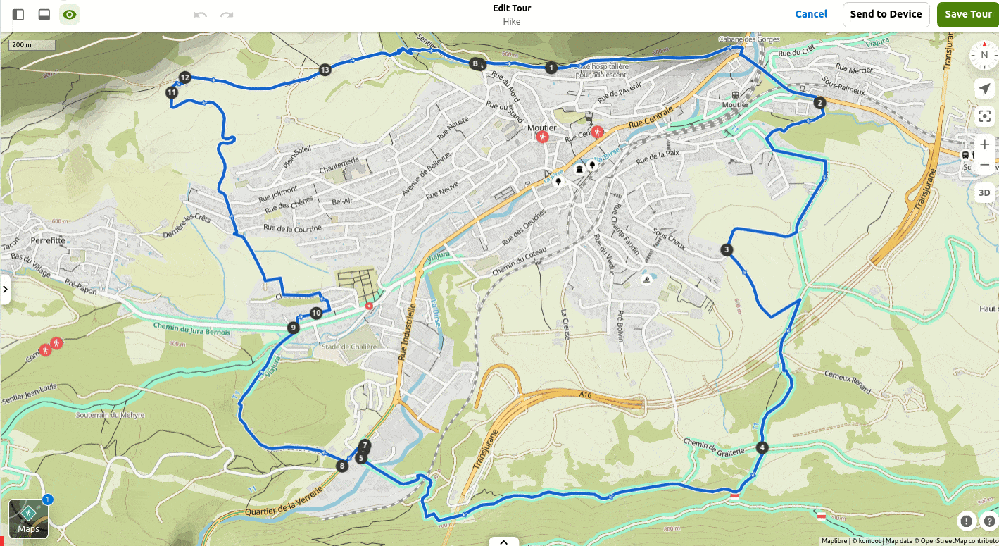                                                                                                     | 
|:--------------------------------------------------------------------------------------------------------------------------------------------------------------------------------------------------------------------------------------------:| 
| *When editing the route, two waypoints are moved. The resulting route looks smooth. As fine-tuning step, it is useful to check the **precise position of the waypoints**. Zooming-in shows that **`WP3` and `WP4` are wrongly positioned**.* |

:bulb: Tips:
- When you are satisfied with your plan, zoom in and check the **position of each waypoint**.
- Avoid placing a waypoint **directly on an intersection**.
  - If this does not break the route, try to **position it on the desired path**, just before or after the intersection.
- Remove **unnecessary waypoints**.

</details>

---

#### :white_check_mark: Authorisation / danger

> When downloading a piece of software or opening an attached file in an email, do you not make sure these are `legal` and `safe`?

To some extent, this needs to be checked for the route you have just created.

##### :rescue_worker_helmet: Safety

<details>
  <summary>Click to expand</summary>

> "Anyone can **record the route with their mobile phone** and **download it**. The authors **don't explicitly mention if it's safe**, but they present it with a **big smile** and **encourage people to go**."

[This article](https://guianatura.net/fr/sentiers-les-plus-dangereux-de-tenerife/) by [Sustainable Tourism in Tenerife](https://guianatura.net/en/), continues with:

> "Sometimes they do it **just for the photo**, because these trails and their views always **look great on social media** and offer **breathtaking panoramic views**. Other times they do it **for pure daring**, since small, little-used paths and complicated passages can be **very attractive** if you are **seeking an adrenaline rush**. The truth is that these [dangerous] routes have become fashionable among the most adventurous and often people do not really understand the **danger to which they are are exposing themselves to**."

|                                                                                                                                                                                                                                                                                                         | 
|:--------------------------------------------------------------------------------------------------------------------------------------------------------------------------------------------------------------------------------------------------------------------------------------------------------------------------------------:| 
| *Example of the `Ventanas de Güímar` (Guimar windows): it looks **wonderful**, doesn't it?! The trustworthy `Rother` references it and even as "`TOP`". **Tons of `.gpx` files can easily be found**. But while a serious blog **mentions some risks**, another warns: "this is **not an official trail** and is **not maintained**".* |

:bulb: Tips:
- Check the **date**: when was the tour posted?
- Look at the **comments** and the description.
- Look for the **official website** to find the list of closed paths.

|                                                                                           | 
|:------------------------------------------------------------------------------------------------------------------:| 
| *Checking the **list of closed paths** on an **official website**. Making sure the information is **up-to-date**.* |

</details>

##### :x: :heavy_check_mark: Feasibility

<details>
  <summary>Click to expand</summary>

|                                                                                                                                                                                                                                                                                                                                                                                                                                                                                                                                                                      | 
|:-----------------------------------------------------------------------------------------------------------------------------------------------------------------------------------------------------------------------------------------------------------------------------------------------------------------------------------------------------------------------------------------------------------------------------------------------------------------------------------------------------------------------------------------------------------------------------------------------------:| 
| *Example of the `piton de la fournaise`: on `outdoor-active`, the **official local tourist office** (it should be reliable, right?) promotes [a mountain-bike tour](https://www.outdooractive.com/en/route/mountain-biking/reunion-island/au-piton-de-la-fournaise-en-vtt/20504218/) marked as `TOP`. The `.gpx` is easily exported and imported to `komoot`. A first warning comes: "the route includes segments that are highly dangerous (for `6.31 km`). Finally the trail view offered by `google street view` ends to make it clear: this **route would be infeasible** with a mountain-bike".* |

:bulb: Tips:
- In the above example, the `strava global heatmap` shows some "cycling" activity (though **considerably less** compared to the activity on the main road).
  - It might be people who came by bike and **recorded the hike** while **still in `cycling` mode**.
  - In case of doubt, checking the **street view on the considered path** in `komoot` planner really helps.

</details>

---

##### :no_bicycles: Legal

<details>
  <summary>Click to expand</summary>

While a spot may be **technically safe** and **easy enough** to access (in addition of being beautiful), it can still be **forbidden**. This especially applies to cycling.

|                                                                                                                                                                                                                                                                                                                                                                                                                                                                                                                                                                                                                                                                                                                                                                                                                                                                                                                       | 
|:------------------------------------------------------------------------------------------------------------------------------------------------------------------------------------------------------------------------------------------------------------------------------------------------------------------------------------------------------------------------------------------------------------------------------------------------------------------------------------------------------------------------------------------------------------------------------------------------------------------------------------------------------------------------------------------------------------------------------------------------------------------------------------------------------------------------------------------------------------------------------------------------------------------------------------------------------------:| 
| *Example of the `Huevos del Teide`: these **trails look amazing** for mountain-biking, don't they?! A **`.gpx` file** is quickly and **easily found**. But then **warnings** start to accumulate: `komoot` marks most of the route as "**not permitted for cycling**". The `strava global heatmap` shows almost no activity in this zone (except the climb to `montana blanca`). While many MTB trails are referenced by [`trailforks`](https://www.trailforks.com/region/parque-nacional-del-teide-50478/?activitytype=1&z=10.2&lat=28.27946&lon=-16.58554) on the island, there are none inside Teide National Park. Finally, the official text of **local government** states the **prohibition**. Back to the [nice MTB pic](https://fotografiaycielo.com/portafolio/con-la-bici-en-los-huevos-del-teide/): "If this image motivates you to take your MTB and ride on the trail, you should know that you do so **at your own risk**".* :raised_eyebrow: |

Personal experience: when riding with mountain-bikes on asphalt roads, guards of the national parks kept looking at us, and as we stopped for a break they were reminding that cycling on the trails of the Teide National Park is strictly prohibited. Having prepared a route on the forbidden trails could have been embarrassing.

</details>

---

#### :no_entry: Temporary blockage

<details>
  <summary>Click to expand</summary>

A construction site or a one-day event could **block your route**.

---

##### :construction: Long term

|                                                                                                                                                                                                                                                                                                                                                        | 
|:---------------------------------------------------------------------------------------------------------------------------------------------------------------------------------------------------------------------------------------------------------------------------------------------------------------------------------------------------------------------------------------:| 
| *Example: imagine you are **looking for a nice spot** to make a break along your route. What about this **small lake**? Trying to add a detour to it only results in an incomplete part. A **lock symbol** can be seen: "`Potentially locked barriers`". This is **confirmed by the pictures** as well as by the `strava global heatmap`: the lake and its beach seem **unreachable**.* |

---

##### :no_entry_sign: Short term

For instance, streets could be blocked due to a race:
- Such info is **not easy to found**!
- Checking the event in a given region may give hints, but could be very tedious and still incomplete.
- Usually such events take place during the weekend.

</details>

---

#### :world_map: Other maps

<details>
  <summary>Click to expand</summary>

Utilize different maps, for example:

- [:fr:](https://ignrando.fr/)
- [:switzerland:](https://map.geo.admin.ch/)
- [`outdoor-active`](https://www.outdooractive.com/)

|                                                                    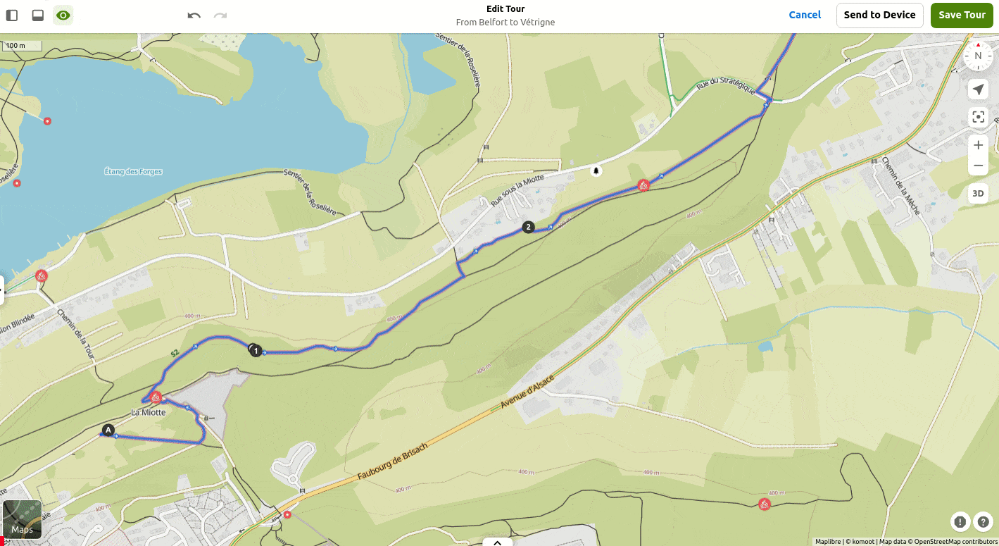                                                                     | 
|:------------------------------------------------------------------------------------------------------------------------------------------------------------------------:| 
| *The **maps of `komoot` and `IGN` differ**: some path exists on one and not on the other. the `strava-global-heatmap` shows that the **`komoot` map looks up-to-date**.* |

</details>

---

---

# :dizzy: Conclusion

Your route is now prepared! :trophy:

Before you go for your adventure, here a couple of **final words** and thoughts.

---

#### :footprints: Final steps

<details>
  <summary>Click to expand</summary>

:compass: **1- To navigate the route:**
- Either [navigate the route](https://support.komoot.com/hc/en-us/sections/360003611812-Navigation) using the `komoot` app.
- Or **download the `.gpx` file** from `komoot` and use it on another navigation device.

:bulb: Tips:
- **Non-premium users** of `komoot` can **download the `.gpx` file of the route** using the [`Komoot to GPX`](https://play.google.com/store/apps/details?id=com.spark71.komoottogpx) app.
  - Make sure to (temporary) make the route "public", otherwise the app will not manage to find and download it.

:adhesive_bandage: **2-** Your adventure, although **carefully planned**, could be disrupted by various factors:
- Personal reasons:
  - Injury :face_with_head_bandage:
  - Mechanical problem :boom:
- External reasons:
  - Delayed / cancelled transport, e.g. train/bus :hourglass_flowing_sand:
  - Blocked route :construction:
  - Changing weather :tornado:

**Preparing an alternative route** may be useful!

</details>

---

#### :boom: Still missing

Below is a **list of missing features** that **would be very helpful** for planning routes.

> Should you know **already existing solutions** or should you have **ideas**, please let me know! :pray:

<details>
  <summary>Click to expand</summary>

- :world_map: **How to overlay maps**.
  - Some examples in previous sections (e.g. [usage frequency](#orange_heart-usage-frequency)) were using both `strava-global-heatmap` and `komoot` map in parallel.
  - Ideally they should be overlaid in one single map.
    - Here [a very nice example](https://chrome.google.com/webstore/detail/id-strava-heatmap/eglbcifjafncknmpmnelckombmgddlco) of a chrome extension to **overlay the `strava-global-heatmap` onto the [`OpenStreetMap` (in "iD editor" mode)](https://www.openstreetmap.org/)**. :+1:
    - It would be nice to extend this tool to other maps such as `komoot`.
  - An alternative to merging aligned maps, is to have them opened in two tabs of the internet browser, and to quickly switching from one to another.
    - The **alignment** of the two maps can be done manually, but it would be convenient to **automate it**. :robot:
    - This should not be too hard:
      - Most maps are displayed based on **`latitude` + `longitude` + `zoom`** parameters. For instance, you can try to identify the `lat`, `long` and `zoom` parameters in these two URLs:
        - `https://www.strava.com/heatmap#11.42/-4.46321/48.33819/bluered/ride`
        - `https://www.komoot.com/plan/@48.3332830,-4.4579533,10.304z?sport=racebike`
      - **Equalizing these parameters** for `strava-global-heatmap` and `komoot` map should **align the maps**.

- :vertical_traffic_light: **Traffic-lights counter**.
  - Current issue: `road-cycling` in a city can become a nightmare if **encountering traffic lights every `500m`**.
  - It would be great to know, **given a planned cycling route**, the **number of traffic lights encountered**.
  - Idea-1: as a first estimate, this could be determined based on the **number of crossroads** along the route.
  - Idea-2: another approach could be to utilize `Google Maps`, which already provides information about **traffic lights** and **stop signs** along your route.

- :oncoming_automobile: **Heatmap of cars**.
  - While it's not always possible to road-cycle on `cycleways` (e.g. due to the surface), **sharing the road** with a high volume of vehicles is not ideal.
  - Idea: it would be useful to find roads with **the less automotive traffic**. :wink:

- :construction: Map of temporary blocked streets.
  - Most maps focus on describing the space. There is **no time dimension**.
  - But indeed it changes over time. For instance, an **event could block certain streets**.
  - Visualizing such **modifications on the map**, based on the **date of the planned activity**, would be beneficial.
  - Idea: such information should be available on the **website of some authorities**, to which organizers have declared their event.  

- :motorway: Map with **asphalt quality**.
  - What a pleasure it is to road cycle on **smooth asphalt**, without any irregularities! :hugs:
  - In contrast, it can be uncomfortable, energy-consuming, and attention-demanding to deal with a **road full of cracks** :face_with_spiral_eyes:
  - Idea: activity trackers, e.g. `garmin`, could **record and analyse the vibrations** during a road-cycling activity to **evaluate accordingly the smoothness** of each road

- :juggling_person: Embed **multiple options inside one single `.gpx`**, and **decide which alternative to follow during the activity**.
  - `komoot` offers some features for **[`mid-Tour route adjustments`](https://www.komoot.com/garmin)**, but the alternative plan is not prepared in advance.
  - Idea: one possible solution is to incorporate **all the alternatives into a single route**, though this may affect the route summary (`elevation`, `distance`).

- :parking: Reliable map of **parking parks**.
  - A car park may be necessary to determine the **starting point** of the activity.
  - Idea: My current approach is to search for "parking" on **`Google Maps` using satellite view**, cross-check with **`Google Street View`**, and review the **latest comments** about the parking places to gather details such as size, price, and operating hours.
  - Having a backup plan is always a good idea.

</details>

---

#### :exclamation: Criticisms

<details>
  <summary>Click to expand</summary>

The presented method **leverages experiences of other people**: `comments`, `pictures`, `routes`.

While this can often ensure a nice outdoor adventure, a couple of points must be kept in mind:

- :star_struck: Do not check every detail in advance; leave room for surprise and wonder.
- :sheep: Do not become a [mouton de Panurge](https://en.wiktionary.org/wiki/mouton_de_Panurge), i.e. one sheep who follows a group without thinking for himself.
- :rescue_worker_helmet: Safety first.
- :partying_face: A `plan` must stay a `plan`: feel free to **improvise** while on the terrain.

</details>

---

#### :wave: Final word

Happy planning, but above all happy outdoor activity! :smiley:
